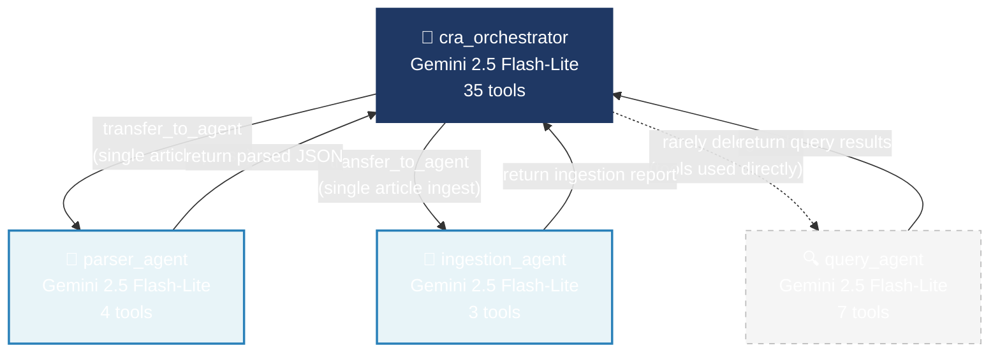
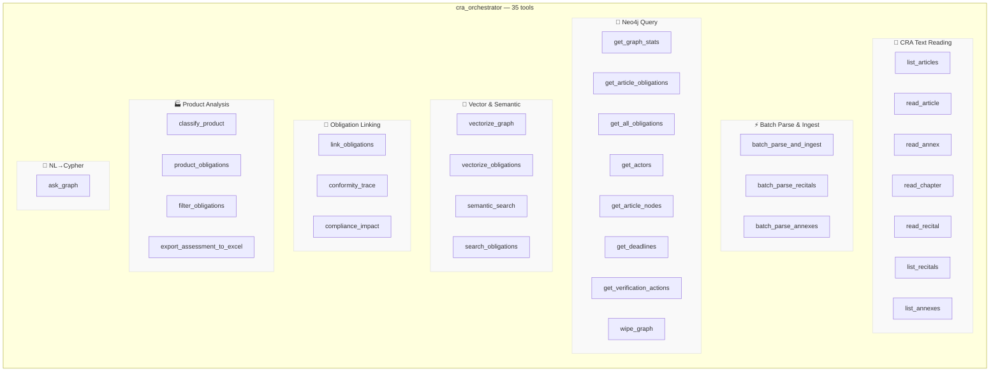
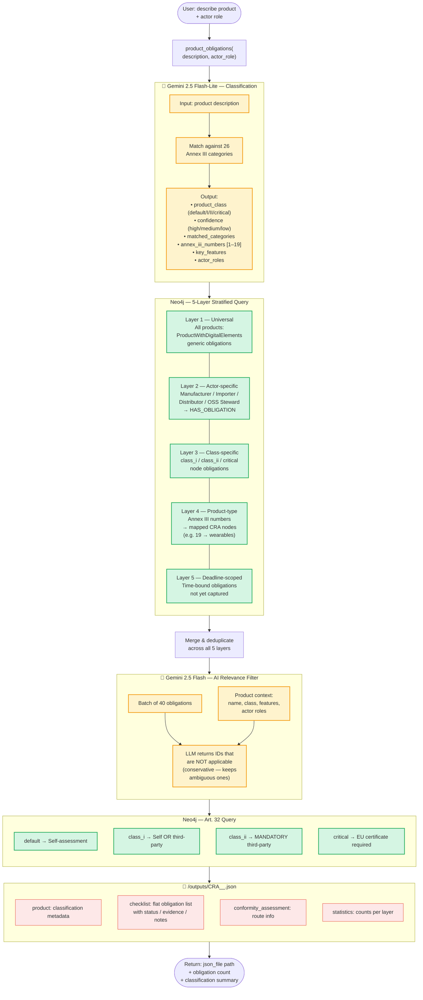
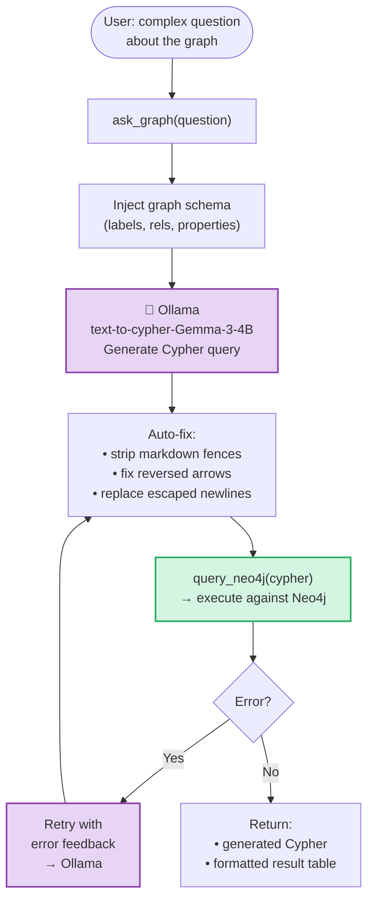
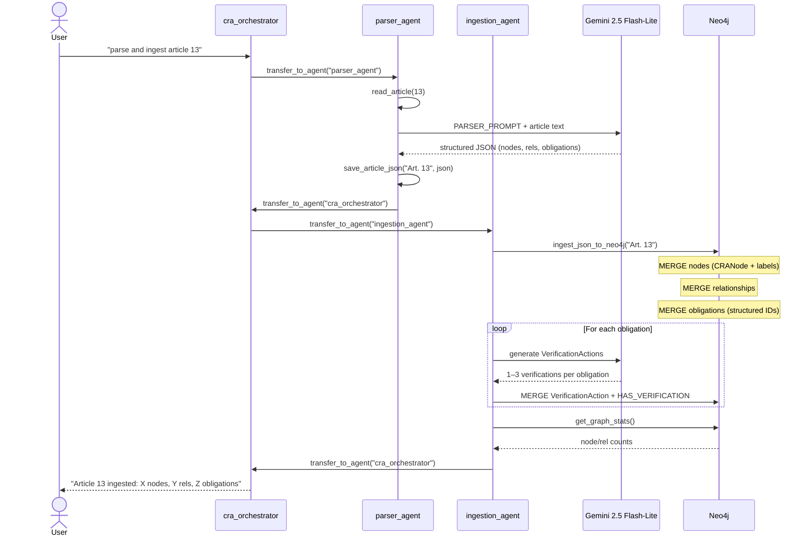
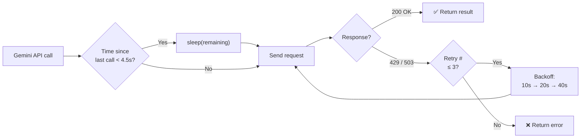

# CRA Agent System — Workflow Organigramme

> Agent orchestration, tool chains, and data flows

---

## 1. Agent Hierarchy



---

## 2. Complete Tool Map



---

## 3. Workflow A — Knowledge Graph Construction

```mermaid
flowchart TD
    START_A([User: "ingest all articles"]) --> BATCH_A["batch_parse_and_ingest\n(article_range='all')"]

    BATCH_A --> LOOP{"For each article\n1 → 71"}

    LOOP --> PARSE_ONE["_parse_one(article_number)"]
    PARSE_ONE --> READ_ART["read_article(N)\n→ CRA markdown text"]
    READ_ART --> GEMINI_PARSE["🤖 Gemini 2.5 Flash-Lite\nPARSER_PROMPT\n+ article text"]
    GEMINI_PARSE --> JSON_OUT["Structured JSON:\n• nodes (11 label types)\n• relationships (20+ types)\n• obligations (id, actor, action)\n• cross-references"]
    JSON_OUT --> SAVE_JSON["save to\n/outputs/articles/art_N.json"]

    SAVE_JSON --> INGEST_ONE["ingest_json_to_neo4j(N)"]

    subgraph INGEST_ONE["Neo4j Ingestion Pipeline"]
        direction TB
        I1["Create constraints\n(UNIQUE on Article, Obligation,\nVerificationAction, CRANode)"]
        I2["MERGE nodes\n:CRANode + specific labels\n(Actor, Product, Concept…)"]
        I3["MERGE relationships\nwith properties & paragraph_ref"]
        I4["MERGE obligations\nStructured ID:\nch{N}_sec{S}_art{A}_par{P}_{i}"]
        I5["Link actor → obligation\n:HAS_OBLIGATION"]
        I6["Link article → obligation\n:CONTAINS_OBLIGATION"]
        I7["Link obligation → nodes\n:RELATES_TO"]
        I8["🤖 Gemini → generate\nVerificationActions\n(1–3 per obligation)"]
        I9["Deduplicate verifications\ncosine similarity > 0.95\n(768-dim nomic-embed-text)"]
        I10["Link obligation → verification\n:HAS_VERIFICATION"]

        I1 --> I2 --> I3 --> I4
        I4 --> I5 & I6 & I7
        I7 --> I8 --> I9 --> I10
    end

    INGEST_ONE --> RATE["⏱️ rate_limit\n4.5s min between\nGemini calls"]
    RATE --> LOOP

    LOOP -->|"all done"| STATS["get_graph_stats()\n→ node/rel counts"]

    classDef gemini fill:#fef3cd,stroke:#f39c12,stroke-width:2px
    classDef neo fill:#d5f5e3,stroke:#27ae60,stroke-width:2px
    class GEMINI_PARSE,I8 gemini
    class I1,I2,I3,I4,I5,I6,I7,I9,I10 neo
```

The same pattern applies to **recitals** (`batch_parse_recitals`, 130 items) and **annexes** (`batch_parse_annexes`, 8 items).

---

## 4. Workflow B — Vectorization & Semantic Search

```mermaid
flowchart TD
    START_V([User: "vectorize the graph"]) --> VG["vectorize_graph(sections='articles')"]

    VG --> SPLIT["Split CRA markdown\ninto chunks\n(1 per article/recital/annex)"]
    SPLIT --> EMBED["🧲 Ollama nomic-embed-text\nbatch of 10 texts\n→ 768-dim vectors"]
    EMBED --> CHUNK_NODES[("Neo4j\nCREATE :CRAChunk nodes\nwith text + embedding")]
    CHUNK_NODES --> INDEX_1["CREATE VECTOR INDEX\ncra_chunk_embedding"]
    CHUNK_NODES --> LINK_ART["MATCH :Article → :CRAChunk\nCREATE :EMBEDS"]

    START_VO([User: "vectorize obligations"]) --> VO["vectorize_obligations()"]
    VO --> EMBED_OBL["🧲 Ollama nomic-embed-text\nall 461+ obligations\n→ 768-dim vectors"]
    EMBED_OBL --> SET_VEC[("Neo4j\nSET obligation.embedding = vector")]
    SET_VEC --> INDEX_2["CREATE VECTOR INDEX\ncra_obligation_embedding"]

    QUERY_SEM([User: "search for SBOM"]) --> SS["search_obligations(query, mode='hybrid')"]
    SS --> KW["Keyword pass\nCONTAINS on action text"]
    SS --> VS["Semantic pass\nvector similarity search"]
    KW --> MERGE_R["Deduplicate & re-rank\nboost dual-match results"]
    VS --> MERGE_R
    MERGE_R --> RESULTS["Top-K obligations\nranked by relevance"]

    classDef ollama fill:#e8d5f5,stroke:#8e44ad,stroke-width:2px
    classDef neo fill:#d5f5e3,stroke:#27ae60,stroke-width:2px
    class EMBED,EMBED_OBL ollama
    class CHUNK_NODES,SET_VEC,INDEX_1,INDEX_2 neo
```

---

## 5. Workflow C — Obligation Linking

```mermaid
flowchart TD
    START_L([User: "link obligations"]) --> LO["link_obligations(mode='full')"]

    LO --> STRUCT["Structural Discovery\n(deterministic)"]

    subgraph STRUCT["Phase 1 — Structural Analysis"]
        direction TB
        S1["_find_intra_article_refines()\nSub-paragraph → parent"]
        S2["_find_cross_article_derives()\nCross-article mandates\nvia shared CRANode"]
        S3["_find_supports_links()\nArt. 24–35 (procedural)\n→ Art. 13–23 (substantive)"]
        S4["_find_complements_links()\nDifferent actors → same goal\n(shared CRANode)"]
    end

    STRUCT --> LLM_PHASE["Phase 2 — LLM Classification"]

    subgraph LLM_PHASE["Ambiguous Pair Resolution"]
        direction TB
        LP1["Select unresolved pairs\n(shared CRANode but\nno structural match)"]
        LP2["🤖 Gemini 2.5 Flash-Lite\n_classify_pair_llm()\n→ relationship type\n+ confidence"]
        LP3["Filter confidence ≥ 0.6\nCREATE relationship"]
        LP1 --> LP2 --> LP3
    end

    LLM_PHASE --> NEO_WRITE[("Neo4j\nMERGE :REFINES\nMERGE :DERIVES_FROM\nMERGE :SUPPORTS\nMERGE :COMPLEMENTS")]

    NEO_WRITE --> TRACE["conformity_trace(topic)\nBFS walk obligation graph\n→ compliance chain"]

    NEO_WRITE --> IMPACT["compliance_impact(obl_ids)\nPropagate compliance\n→ full / partial / evidence"]

    classDef gemini fill:#fef3cd,stroke:#f39c12,stroke-width:2px
    classDef neo fill:#d5f5e3,stroke:#27ae60,stroke-width:2px
    class LP2 gemini
    class NEO_WRITE neo
```

---

## 6. Workflow D — Product Obligations (Main Pipeline)



---

## 7. Workflow E — NL → Cypher Query



---

## 8. Single Article Parse → Ingest (via Sub-agents)



---

## 9. Technology & External Dependencies

| Component | Technology | Purpose |
|-----------|-----------|---------|
| **Agent framework** | Google ADK | Multi-agent orchestration |
| **LLM (parsing, classification, filtering)** | Gemini 2.5 Flash-Lite | JSON extraction, product analysis |
| **LLM (obligation filtering)** | Gemini 2.5 Flash | Higher-quality relevance filtering |
| **NL→Cypher** | Ollama + Gemma-3-4B text-to-cypher | Natural language graph queries |
| **Embeddings** | Ollama + nomic-embed-text (768-dim) | Semantic search vectors |
| **Graph database** | Neo4j 5.x (bolt://localhost:7687) | Knowledge graph + vector indexes |
| **Rate limiting** | Custom callbacks (4.5s min interval) | Free tier compliance (15 RPM) |
| **Error recovery** | Exponential backoff (10s/20s/40s) | 429 / RESOURCE_EXHAUSTED retry |
| **Output format** | JSON files + Excel (openpyxl) | Compliance checklists |

---

## 10. Rate Limiting & Resilience



┌───────────────────────────────────────────────────────────┐
│  FRONTEND          React 19 + TypeScript + Vite           │
│                    react-router-dom 7                      │
│                    localhost:5173                           │
├───────────────────────────────────────────────────────────┤
│  BACKEND           FastAPI + SQLAlchemy + uvicorn          │
│                    localhost:8000                           │
├───────────────────────────────────────────────────────────┤
│  DATABASES         SQLite (assessment.db) — user data      │
│                    Neo4j (bolt://7687)    — CRA ontology   │
├───────────────────────────────────────────────────────────┤
│  AI / LLM          Gemini 2.5 Flash-Lite — classification  │
│                    Gemini 2.5 Flash      — filtering       │
├───────────────────────────────────────────────────────────┤
│  AGENT FRAMEWORK   Google ADK (cra_agents/)                │
└───────────────────────────────────────────────────────────┘